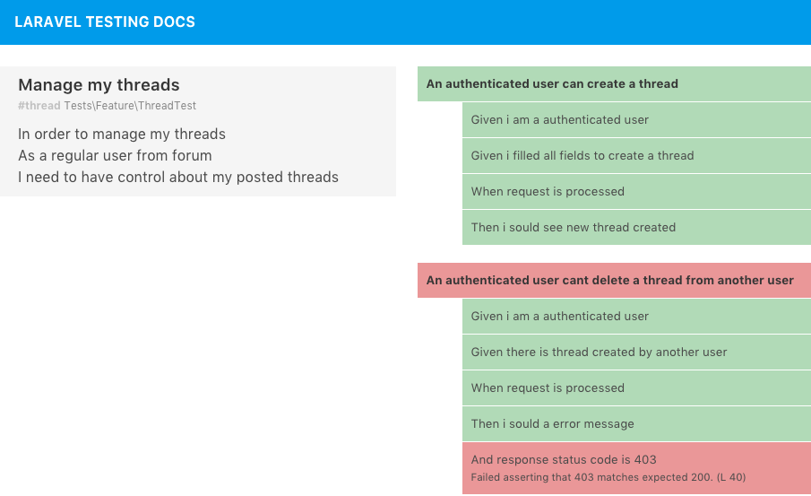

# WIP

- Very first try, so there is no elegant solution implemeted
- Improving english docs translations.

# Laravel Testing Docs

TDD is a great way to develpe a software. The development flow is clean and fluid. And, if you use the BDD approach to do it, you have very strcutured testing file and give us a opportunity to document it.

# Background

As we know BEHAT give us a very structed way to use BDD and write tests. Althoug the generated `classes` and `methods` are very bit confuse and not much readble, as your software grows. There are a greate formatter plugin that provide a report from all your testing features. In adiction you have some config in order to integrate BEHAT with Laravel.


````
Feature: Listing command
  In order to change the structure of the folder I am currently in
  As a UNIX user
  I need to be able see the currently available files and folders there

  Scenario: Listing two files in a directory
    Given I am in a directory "test"
    And I have a file named "foo"
    And I have a file named "bar"
    When I run "ls"
    Then I should get: "bar"

  [...] another scenarios from this same feature [...]

````

And if we could to have same result with zero config, by just commenting your testing files?


# Example

## Input

```

<?php

namespace Tests\Feature;

use Tests\TestCase;

/**
 * 
 * @feature Manage my threads
 * @tag threads
 * 
 * In order to manage my threads 
 * As a regular user from forum
 * I need to have control about my posted threads
 * 
 */
class ThreadTest extends TestCase
{
    public function test_An_authenticated_user_can_create_a_thread()
    {
        /** Given i am a authenticated user */
        $user = factory('App\User')->create();

        /** Given i filled all fields to create a thread */
        $thread = factory('App\Thread')->make();

        /** When request is processed */
        $response = $this->actingAs($user)->post('/api/threads', $thread->toArray());

        /** Then i sould see new thread created */
        $response->assertJsonFragment($thread);

    }

    public function test_An_authenticated_user_cant_delete_a_thread_from_another_user()
    {
        /** Given i am a authenticated user */
        $user1 = factory('App\User')->create();

        /** Given there is thread created by another user */
        $user2 = factory('App\User')->create();        
        $thread = factory('App\Thread')->create(['user_id' => $user->id]);

        /** When request is processed */
        $response = $this->actingAs($user)->delete("/api/threads/{$thread->id}");

        /** Then i sould a error message */
        $response->assertJsonFragment(['error' => 'You cant delete a thread from another user.']);

        /** And response status code is 403 */
        $response->assertStatus(403);
    }
}

```
## Output



# How it works

1) It read all testing files from `tests/Feature` folder

2) It searchs for doc block  on `class` section (feature description) 

3) It search for `inline comments` (steps) on each `method` (scenarios titles).


# Assumptions

## General 

- Each file on `tests/Feature` folder is a `feature`

- Each `method` from that `class` is a `scenario`.

## Comments

- The `class` must have a full doc block comment 
    - it must have a `@feature` anotation
    - it must have a `@tag` anotation

- Each `method` from `class` must have a `test_` prefix
 - the `inline comment` from `method` comment must be in this format `/** */`
 
# Inspiration
- Behat
- Behate formatter plugin

# Contribuing

# TODO


- Filter by tag
- Graphs
